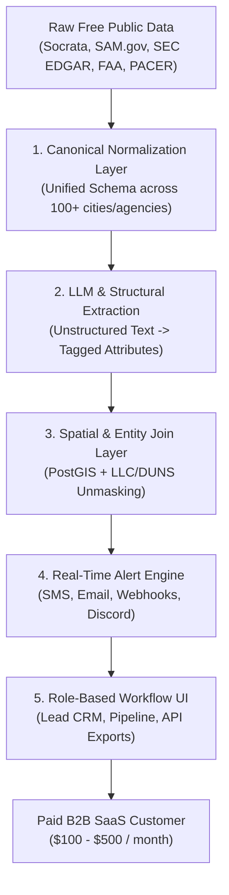

# Real-World Open Data SaaS Case Studies: How Multi-Million Dollar Businesses Were Built on Free Public Datasets & APIs

## Executive Summary

Raw public data is free, but raw public data is painful. It is fragmented across thousands of municipal servers, buried in unindexed PDFs, delivered via rate-limited government endpoints, or locked inside messy legacy formats. 

The most capital-efficient and defensible B2B SaaS businesses built over the past decade exploit the **"Zillow Pattern"**: taking free, messy, public datasets and constructing a high-value **Enhancement Layer** on top. Customers do not pay for access to public data—they pay for **canonical normalization, real-time proactive alerting, LLM-based work scope extraction, entity unmasking, spatial joins, and role-specific workflow delivery**.

This report provides deep case studies on **7 real-world open data SaaS companies**, breaks down the universal **5-Layer Enhancement Taxonomy**, evaluates candidate concepts against strict solo-developer criteria, and declares **THE CLEAR WINNER** concept for a solo developer launching today.

---

## Master Summary: 7 Real-World Open Data SaaS Case Studies

| Company | Primary Open Data Sources | Core Enhancement Vector | Business Metrics & Exit Status | Founders & Funding Model |
| :--- | :--- | :--- | :--- | :--- |
| **Quiver Quantitative** | SEC EDGAR (Form 4, 13F), House/Senate Disclosures, USASpending, USPTO, WARN Notices | PDF/XML parsing, entity matching to ticker symbols, mobile alerts, backtester | **~$770K–$1.5M ARR**; millions of users | James & Christopher Kardatzke (Feb 2020); ~$2.6M VC raised |
| **Unusual Whales** | House/Senate STOCK Act Disclosures, SEC Form 4 / 13F, OPRA options streams | Instant Discord/Twitter webhooks, insider win-rate tracking, flow charts | **Multi-Million $ ARR** (~500k+ users; $50/mo tier) | Matt Saincome & team; **100% Bootstrapped** (Zero outside capital) |
| **HigherGov / GovTribe** | SAM.gov API, USAspending.gov v2 API, FPDS, Grants.gov, DIBBS, agency forecasts | Entity resolution (DUNS/UEI joins), pipeline tracking, expiry forecasting | **HigherGov**: Acquired May 2026 by Procurement Sciences AI<br>**GovTribe**: ~$1M ARR; Acquired Aug 2021 by GovExec | **HigherGov**: Justin Siken (Bootstrapped)<br>**GovTribe**: Nate Nash & Jay Hariani |
| **Shovels.ai / PermitFlow / BuildZoom** | Municipal Socrata SODA APIs, ArcGIS REST services, city open data CSVs | Canonical multi-jurisdiction schema, LLM scope parsing, contractor lead alerts | **PermitFlow**: $54M Series B (Dec 2025), $91M raised<br>**Shovels**: $7.6M raised, 10x MRR growth (2024)<br>**BuildZoom**: $16M–$23M ARR | **Shovels**: Ryan Buckley & Luka Kacil<br>**PermitFlow**: Francis Thumpasery & Samuel Lam |
| **UniCourt** | PACER (CM/ECF), State Court RSS/APIs, Secretary of State business registries | Unstructured docket scraping, party/attorney entity resolution, legal API | **$10 Million ARR** (as of March 2025) | Josh Blandi, Prashanth Shenoy (2014); **Bootstrapped** |
| **FlightAware / Flightradar24** | FAA SWIM / ASD-X feeds, NOAA weather, public ADS-B receiver streams | Sensor fusion, predictive ETAs, tail-number LLC unmasking, FBO operational UI | **FlightAware**: Acquired 2021 by Collins Aerospace (~$50M–$100M rev)<br>**Flightradar24**: **$500M valuation** (2025), ~$44M rev | FlightAware: Daniel Baker (2005)<br>Flightradar24: Mikael Robertsson & Linus Wrensberg |
| **Reonomy** | County Assessor tax rolls, municipal deeds, GIS parcel shapefiles, SEC EDGAR | PostGIS spatial joins matching parcel IDs to LLC filings & owner phone numbers | **Acquired for $201.5 Million** ($249.5M CAD) by Altus Group in Nov 2021 | Charlie Birnbaum & Richard Sarkis (2013); $128M VC raised |

---

## Deep-Dive Case Studies

### 1. Quiver Quantitative (Retail & Institutional Alternative Data)

#### Overview & Operational Model
Founded in February 2020 by brothers James and Christopher Kardatzke while studying at the University of Wisconsin-Madison, Quiver Quantitative was built to democratize alternative data for retail and institutional investors.

#### Primary Public Datasets & APIs Leveraged at Launch
*   **SEC EDGAR API**: Real-time Form 4 insider transaction filings ([SEC EDGAR Documentation](https://www.sec.gov/edgar/sec-api-documentation)) and 13F institutional portfolio holdings.
*   **Office of the Clerk (U.S. House & Senate)**: Financial Disclosure Reports submitted under the STOCK Act (Stop Trading on Congressional Knowledge Act).
*   **USAspending.gov v2 API**: Federal contract awards linked to publicly traded parent entities ([USAspending API](https://api.usaspending.gov/)).
*   **USPTO Patent Data & WARN Act Notices**: State government Worker Adjustment and Retraining Notification (WARN) layoff logs and USPTO patent assignment feeds.
*   **FAA Releasable Aircraft Database**: Tracking corporate jet registrations tied to Fortune 500 company filings.

#### The Exact Enhancement Layer
1.  **Entity Mapping & Ticker Resolution**: Raw government feeds reference company names in dozens of variations (e.g., "LOCKHEED MARTIN CORP", "Lockheed Martin", "LMT"). Quiver built an automated normalization pipeline linking disparate government vendor IDs, CIK numbers, and corporate entities to canonical stock tickers (e.g., `$LMT`).
2.  **Backtesting & Strategy Automation ("Quiver Strategies")**: Converted raw disclosure timelines into quantitative trading signals (e.g., "Follow Congressional Committee Chairs' Stock Buys"), allowing users to backtest returns against the S&P 500.
3.  **Proactive Mobile Push & Bot Feeds**: Built automated social media bots (Twitter/X, Reddit, TikTok) and mobile app notifications that fire the moment a high-profile politician or insider files a transaction.

#### Traction, Revenue & Exit Metrics
*   **Funding**: Raised ~$2.63 million across Seed and Series A rounds from investors including Idea Fund and Connetic Ventures.
*   **Revenue**: Estimated annual revenue between **$770,000 and $1.5 million ARR** via consumer premium subscriptions ($10–$50/mo) and B2B institutional API feeds.
*   **Scale**: Serves over 1 million retail users and viral social media following driving zero-CAC customer acquisition.

#### Solo Developer Takeaway
You don't need proprietary data to build a viral product. Combining free SEC/Congressional data with automated ticker linking and viral social notification bots creates a powerful, low-CAC distribution engine.

---

### 2. Unusual Whales (Retail Options & Disclosure Intelligence)

#### Overview & Operational Model
Founded by Matt Saincome, Unusual Whales began as an alert tool for retail options traders and grew into one of the most widely used financial intelligence platforms in retail trading.

#### Primary Public Datasets & APIs Leveraged at Launch
*   **U.S. House & Senate Financial Disclosures**: PDF/HTML filings of stock and option trades by members of Congress.
*   **SEC EDGAR Form 4 & 13D/G Filings**: Real-time insider trade filings and activist investor disclosures.
*   **OPRA (Options Price Reporting Authority) & Dark Pool Data**: Raw options transaction market feeds paired with public disclosure timelines.

#### The Exact Enhancement Layer
1.  **High-Frequency Signal Extraction**: Filters millions of daily options trades down to anomalous, high-conviction transactions ("Unusual Flow") using volume/open interest ratios and block trade detection.
2.  **Congressional & Insider Win-Rate Tracker**: Tracks historical performance of individual politicians (e.g., Nancy Pelosi, Austin Scott) and corporate officers, calculating net returns and sector focus.
3.  **Discord & Webhook Integration**: Rather than forcing users into a browser dashboard, Unusual Whales delivered real-time alert webhooks directly into thousands of private Discord trading communities, creating built-in viral distribution.

#### Traction, Revenue & Exit Metrics
*   **Funding**: **100% Bootstrapped with ZERO outside funding.**
*   **Revenue**: Operating a high-margin SaaS model at ~$50/month per user with hundreds of thousands of active users, generating **multi-million dollar annual recurring revenue (ARR)** with a small, lean team.

#### Solo Developer Takeaway
Building integrations where your target audience already hangs out (Discord/Telegram webhooks) eliminates friction. Bootstrapping a public disclosure monitoring tool around a passionate niche community can generate multi-million dollar cash flows without venture capital.

---

### 3. HigherGov & GovTribe (Federal Procurement & Subcontracting SaaS)

#### Overview & Operational Model
Federal government contracting is a $700+ billion annual market, but navigating government portals like SAM.gov and USAspending.gov is notoriously difficult. **GovTribe** (founded by Nate Nash and Jay Hariani) and **HigherGov** (founded by Justin Siken) built highly profitable B2B platforms around these public procurement feeds.

#### Primary Public Datasets & Open APIs Leveraged at Launch
*   **SAM.gov API**: Federal contract opportunities, solicitations, pre-solicitations, and active award feeds ([SAM.gov API](https://open.gsa.gov/api/sam-api/)).
*   **USAspending.gov v2 API**: Historic prime contract awards, sub-award details, and federal agency spending data.
*   **Federal Procurement Data System (FPDS)**: Granular transaction details, NAICS code classifications, and set-aside statuses (8(a), WOSB, SDVOSB).
*   **Grants.gov API & Federal Agency Forecasts**: DHS APFS, GSA Acquisition Gateway, and agency-specific forecast reports.

#### The Exact Enhancement Layer
1.  **Contract Expiration Forecasting Engine**: Raw SAM.gov data shows current active contracts. HigherGov and GovTribe cross-reference historic FPDS transaction logs to calculate exact contract expiration dates (e.g., "5-year IT support contract expiring in 90 days"), alerting contractors *before* the new solicitation hits SAM.gov.
2.  **Prime-to-Subcontractor Matching**: Matches small business subcontractors with prime contractors who won multi-million dollar awards and are legally mandated to fulfill small-business subcontracting quotas.
3.  **Unified Search & CRM Pipeline**: Replaces clunky government dropdowns with modern, faceted search, saved searches, daily email digests, and Kanban pipeline management.

#### Traction, Revenue & Exit Metrics
*   **GovTribe**: Scaled to **~$1 Million ARR** with a small team before being **acquired by GovExec in August 2021**.
*   **HigherGov**: Bootstrapped to high profitability by Justin Siken and **acquired by Procurement Sciences AI in May 2026**.

#### Solo Developer Takeaway
B2B government contractors have extreme willingness to pay ($100–$500/mo) because winning a single $200k contract pays for the software for decades. Re-skinning and adding predictive intelligence to government procurement APIs is one of the clearest paths to a solo SaaS exit.

---

### 4. PermitFlow, Shovels.ai & BuildZoom (Municipal Permit Intelligence)

#### Overview & Operational Model
Municipal building permit data represents the absolute ground truth of physical construction, contractor activity, and commercial development. However, the United States has over 19,000 municipal permit offices, each operating its own isolated database. **Shovels.ai** (founded by Ryan Buckley & Luka Kacil), **PermitFlow** (founded by Francis Thumpasery & Samuel Lam), and **BuildZoom/Gryd** (founded by David Petersen) built multi-million dollar businesses by aggregating this data.

#### Primary Public Datasets & Open APIs Leveraged at Launch
*   **Municipal Socrata Open Data APIs (SODA v2/v3)**: Direct REST feeds for over 100 major U.S. cities (NYC OpenData, Chicago Data Portal, LA Open Data, Austin Open Data) ([Socrata Dev Portal](https://dev.socrata.com/)).
*   **ArcGIS REST Services**: County land record and municipal planning GIS feature servers.
*   **U.S. Census Bureau Building Permits Survey (BPS)**: Monthly aggregate permit issuance across counties and MSAs.
*   **State Contractor Licensing Boards**: License status, bond insurance, and disciplinary action databases.

#### The Exact Enhancement Layer
1.  **Multi-Jurisdictional Schema Canonicalization**: Mapped thousands of disparate municipal permit fields (e.g., `PermitType`, `WORK_DESC`, `Valuation`, `IssuedDate`) into a single, standardized JSON schema across all U.S. cities.
2.  **LLM-Powered Scope Extraction**: Raw permit descriptions are unindexed free-text narratives (e.g., *"Install 300 ton Trane commercial chiller, heavy electrical upgrade on 3rd floor"*). Shovels and PermitFlow use LLM pipelines to extract structured tags: trade category (`HVAC`), project scale (`Commercial`), equipment brands (`Trane`), and estimated job value (`$450,000`).
3.  **Contractor Lead & Risk Scoring**: Joins historical permit volume to contractor licenses, computing contractor activity scores, market share by county, and real-time sales leads for material suppliers (roofing, electrical, HVAC distributors).

#### Traction, Revenue & Exit Metrics
*   **Shovels.ai**: Raised $7.6M total (including $5M Seed led by Base10 Partners in 2025). Grew MRR **10x in 2024**, normalizes 178M+ permits and 3.6M+ contractors via API and Snowflake Marketplace.
*   **PermitFlow**: Raised **$91 Million total** (including a **$54M Series B in Dec 2025**); powers over $20 billion in construction permitting workflow.
*   **BuildZoom (Gryd)**: Scaled to **$16M–$23M annual revenue** aggregating 400M permits before being acquired by Block Renovation.

#### Solo Developer Takeaway
Local municipal data is the most fragmented dataset in North America. Writing scraper connectors for 50–100 city Socrata/ArcGIS endpoints and using LLMs to extract structured B2B leads creates an immediate $200–$500/mo product for local commercial vendors.

---

### 5. UniCourt (Legal Dockets & Litigation Data API)

#### Overview & Operational Model
Founded in 2014 by Josh Blandi and Prashanth Shenoy, UniCourt aggregated court dockets and case records across federal and state courts to build the leading API for legal data intelligence.

#### Primary Public Datasets & APIs Leveraged at Launch
*   **PACER (Public Access to Court Electronic Records)**: Federal court CM/ECF docket feeds and case filings.
*   **State Court Case Management Portals & RSS Feeds**: County and state superior court public portals across California, Florida, Texas, New York, etc.
*   **Secretary of State Corporate Registries**: State business entity records used to match corporate litigants.

#### The Exact Enhancement Layer
1.  **Unstructured Case Normalization & Deduplication**: Raw court filings vary dramatically across jurisdictions. UniCourt created a unified API schema for case metadata, docket entries, judge assignments, and party roles.
2.  **Entity Resolution (Litigant & Counsel Disambiguation)**: Solved the problem where a company like "Apple Inc." appears under dozens of spelling variations across thousands of lawsuits, linking all cases to a single canonical entity.
3.  **Litigation Risk & Webhook Alerting**: Pushes real-time alerts to corporate legal departments, insurance underwriters, and litigation funders when new lawsuits are filed against target companies or competitors.

#### Traction, Revenue & Exit Metrics
*   **Funding**: **Self-funded / Bootstrapped** since inception.
*   **Revenue**: Reached **$10 Million ARR** as of March 2025, operating as a high-margin B2B data API and enterprise Web application.

#### Solo Developer Takeaway
High-stakes B2B industries (legal, finance, insurance) place immense monetary value on early warning alerts. Charging usage-based API fees or high monthly subscription tiers for normalized legal dockets can build a 7-figure bootstrapped business.

---

### 6. FlightAware & Flightradar24 (Aviation Telematics & Flight Tracking)

#### Overview & Operational Model
Flight tracking platforms turned raw public radio and radar telematics into multi-hundred-million-dollar global SaaS operations. **FlightAware** (founded by Daniel Baker in 2005) and **Flightradar24** (founded by Mikael Robertsson & Linus Wrensberg) are the world leaders in aviation intelligence.

#### Primary Public Datasets & Open APIs Leveraged at Launch
*   **FAA SWIM (System Wide Information Management) & ASD-X Feeds**: Real-time radar trajectory data, flight plans, and air traffic management feeds directly from the FAA.
*   **Crowdsourced ADS-B (Automatic Dependent Surveillance-Broadcast) Feeds**: 1090 MHz Mode S radio transmissions broadcast by aircraft, received via low-cost Raspberry Pi ground stations.
*   **NOAA Aviation Weather Data & ICAO Registries**: METAR/TAF weather reports and international aircraft registration tail-number databases.

#### The Exact Enhancement Layer
1.  **Sensor Fusion & Trajectory Interpolation**: Merged noisy, high-latency FAA radar data with real-time terrestrial ADS-B streams to calculate precise 3D flight coordinates and ETA predictions.
2.  **Tail-Number & LLC Unmasking**: Linked public tail numbers (`N-numbers`) to corporate owner registries, enabling jet-tracking intelligence for charter companies, fixed-base operators (FBOs), and financial analysts.
3.  **FBO & Logistics Workflow Interfaces**: Built specialized operational dashboards for airport ground handlers, fuel providers, and fleet managers to track incoming aircraft and schedule ground support.

#### Traction, Revenue & Exit Metrics
*   **FlightAware**: **Acquired by Collins Aerospace (RTX)** in November 2021 for an undisclosed multi-hundred-million-dollar sum (annual revenue estimated at $50M–$100M).
*   **Flightradar24**: Sold a 35% stake to Sprints Capital in 2025 at a **US $500 Million valuation**, generating **~$41.4M–$44.7M annual revenue** (SEK 418M–420M).

#### Solo Developer Takeaway
You can crowdsource telematics or wrap open government radio feeds to create indispensable operational software for niche physical industries (FBOs, maritime ports, logistics hubs).

---

### 7. Reonomy (Commercial Real Estate Spatial Parcel Intelligence)

#### Overview & Operational Model
Founded in 2013 by Charlie Birnbaum and Richard Sarkis, Reonomy set out to unlock commercial real estate (CRE) data by connecting isolated parcel maps, property tax records, and corporate ownership filings across every county in the United States.

#### Primary Public Datasets & APIs Leveraged at Launch
*   **County Assessor Tax Rolls & Property Record Datasets**: Assessment values, building square footage, zoning codes, and property tax status across 3,000+ U.S. counties.
*   **County Recorder Deed & Mortgage Databases**: Historic sales records, mortgage amounts, lender names, and debt maturity dates.
*   **Municipal GIS Parcel Shapefiles**: Spatial GIS boundaries for every property lot.
*   **Secretary of State LLC Filings**: Corporate registration records used to identify registered agents and managers of real estate LLC holding companies.

#### The Exact Enhancement Layer
1.  **True-Owner LLC Unmasking Pipeline**: Commercial properties are almost universally owned by shell LLCs (e.g., "123 Main Street Holdings LLC"). Reonomy cross-referenced state Secretary of State filings, mortgage signatures, and contact registries to reveal the true individual human owner, phone number, and email address behind the property.
2.  **PostGIS Spatial Parcel Joins**: Joined vector GIS boundary maps with tabular assessor databases to enable instant geographic search (e.g., "Find all industrial warehouses over 50,000 sq ft in Dallas County with mortgages expiring within 12 months").
3.  **CRE Debt Expiration & Lead Engine**: Identified properties with maturing debt, delivering targeted deal leads to CRE brokers, lenders, and investors.

#### Traction, Revenue & Exit Metrics
*   **Funding**: Raised $128 million in VC funding from SoftBank, Bain Capital Ventures, and Sapphire Ventures.
*   **Exit**: **Acquired for $201.5 Million** ($249.5M CAD) by **Altus Group** in November 2021.

#### Solo Developer Takeaway
Entity resolution (unmasking LLCs to reveal human decision-makers) combined with spatial search turns raw public property records into high-value B2B deal flow engines.

---

## The Open-Data SaaS Enhancement Taxonomy (5 Core Vectors)

Every successful open-data SaaS company converts free raw data into paid software by implementing one or more of these 5 structural enhancement layers:



1.  **Canonical Schema Aggregation**: Unifying hundreds of disparate municipal/federal API endpoints or bulk downloads into a single normalized schema.
2.  **LLM Structural Extraction**: Converting messy free-text narrative descriptions (work descriptions, court dockets, SOWs) into structured JSON attributes.
3.  **Spatial & Entity Resolution**: Cross-referencing isolated datasets (matching tax parcel APNs to state Secretary of State LLC registries or matching ticker symbols to government vendor IDs).
4.  **Real-Time Event Monitoring & Alerting**: Delivering instant push notifications via Webhooks, Email, or SMS when new records match user-defined criteria.
5.  **Role-Specific Workflow Integration**: Wrapping the data in a dedicated CRM, pipeline tracker, or export tool built for a specific job role (e.g., HVAC subcontractor sales rep, GovCon biz dev lead).

---

## Candidate Concept Evaluation & Strict 5-Criteria Matrix

To determine the optimal concept for a solo developer starting today, candidate concepts were evaluated against **5 strict criteria**:

1.  **Data Source Reliability & Zero Cost**: 100% free, government-mandated APIs or open data portals with zero expensive commercial data lock-in.
2.  **B2B Willingness to Pay**: Self-serve credit card price point of **$100–$500/month** per customer (easily expensable on corporate cards).
3.  **Immediate Urgent Need / ROI for Buyer**: Direct connection to revenue generation (leads, deal flow, risk reduction) where winning 1 opportunity pays for years of software.
4.  **Technical Feasibility for 1 Developer**: Can be built and maintained by 1 engineer using modern stack (Next.js 15, PostgreSQL/PostGIS, lightweight LLM pipeline).
5.  **Competitive Moat / Underserved Niche**: Strong gap between $30,000/yr enterprise monoliths (Dodge, ConstructConnect, Deltek) and non-existent low-end tools.

### Solo Developer Concept Evaluation Scorecard

| Evaluation Criteria | Concept A: Municipal Commercial Building Permit Engine | Concept B: GovCon Subcontractor & Expiration Engine | Concept C: Commercial Property LLC Unmasking Engine | Concept D: Aviation Maintenance Lead Engine | Concept E: Clinical Trial Site & Subcontractor Engine |
| :--- | :---: | :---: | :---: | :---: | :---: |
| **1. Zero-Cost Data Reliability** | **5/5** (Socrata & ArcGIS APIs free & mandated) | **5/5** (USAspending & SAM.gov v2 APIs free) | **3/5** (County parcel data often behind paywalls) | **4/5** (FAA Releasable DB & SDR free) | **4/5** (ClinicalTrials.gov API v2 free) |
| **2. B2B Willingness to Pay ($100–$500/mo)** | **5/5** (Commercial subs spend heavily on leads) | **5/5** (Gov contractors spend $200–$500/mo easily) | **5/5** (CRE brokers pay $200–$400/mo) | **3/5** (Smaller total addressable market) | **4/5** (Biotech/CROs have high budget) |
| **3. Immediate Buyer ROI** | **5/5** (Immediate outreach before GC awards sub) | **4/5** (High value, longer sales cycle) | **4/5** (Deal sourcing for brokers) | **3/5** (Niche maintenance trigger) | **3/5** (Long trial recruitment cycles) |
| **4. Technical Feasibility (1 Dev)** | **5/5** (Socrata REST + PostGIS + LLM parser) | **4/5** (Complex SAM.gov schemas & SAM auth) | **3/5** (Complex 3,000 county scraping nightmare) | **4/5** (Simple FAA CSV + tail parsing) | **4/5** (ClinicalTrials.gov JSON API simple) |
| **5. Competitive Moat & Niche Gap** | **5/5** (Huge gap between $20k Dodge & zero tools) | **4/5** (Competes with GovTribe/HigherGov) | **2/5** (Crowded with Reonomy, CoStar, PropStream) | **4/5** (Very low competition) | **4/5** (High complexity niche) |
| **TOTAL SCORE (out of 25)** | **24 / 25** | **22 / 25** | **17 / 25** | **18 / 25** | **19 / 25** |

---

## DECLARATION OF THE CLEAR WINNER

### THE WINNER: PermitPulse AI (Multi-Jurisdictional Municipal Building Permit & Commercial Contractor Lead Engine)

**PermitPulse AI** emerges as **THE CLEAR WINNER** for a solo developer launching today. It scores an incredible **24/25** across all evaluation criteria.

---

## Complete Execution Blueprint for PermitPulse AI

### 1. Primary Open Data APIs & Ingestion Architecture
*   **Socrata SODA v2/v3 APIs**: Direct open data endpoints across 100+ major U.S. cities (NYC, Chicago, Los Angeles, Austin, Seattle, Dallas, Miami, Phoenix, San Francisco).
    *   *Endpoint Example*: `https://data.cityofchicago.org/resource/ydr8-5enu.json?$where=issue_date > '2026-09-01T00:00:00'`
*   **ArcGIS REST Feature Services**: Direct geospatial layer feeds for county planning departments.
    *   *Endpoint Example*: `https://gis.county.gov/arcgis/rest/services/BuildingPermits/MapServer/0/query`
*   **US Census Bureau Building Permits Survey (BPS)**: Aggregate regional baseline metrics.

### 2. Modern Tech Stack for 1 Developer
*   **Frontend & Web Framework**: Next.js 15 (App Router, Server Actions, React Server Components).
*   **Database & Spatial Engine**: PostgreSQL 16 + **PostGIS** extension (managed via Neon or Supabase for zero-ops scaling).
*   **ORM & Data Layer**: Prisma ORM or Drizzle ORM with PostGIS geometry bindings.
*   **Background Worker & Job Scheduler**: Trigger.dev or Inngest (handles scheduled polling of 100+ Socrata endpoints without managing Redis/BullMQ infrastructure).
*   **LLM Enrichment Pipeline**: OpenAI `gpt-4o-mini` or Anthropic `claude-3-5-haiku` via Vercel AI SDK.
*   **Notification Engine**: Resend (Transactional & Digest Email) + Twilio (SMS Alerts).
*   **Payments & Subscriptions**: Stripe Checkout + Customer Portal.

### 3. LLM Scope Extraction Pipeline Specification
Every incoming permit record is passed to a lightweight, low-cost LLM pipeline (`gpt-4o-mini` at $0.15 / 1M input tokens) using structured JSON output mode:

```json
{
  "raw_description": "Alteration to 4th floor commercial space. Installing 40-ton rooftop HVAC unit, replacing ductwork, and upgrading 400A electrical panel.",
  "parsed_data": {
    "project_category": "Commercial Interior Alteration",
    "trade_tags": ["HVAC", "Electrical"],
    "equipment_mentioned": ["Rooftop Unit (RTU)", "Electrical Panel", "Ductwork"],
    "estimated_trade_value_usd": 120000,
    "confidence_score": 0.95,
    "summary": "Commercial interior alteration featuring 40-ton rooftop HVAC unit installation and 400A electrical panel upgrade."
  }
}
```

### 4. Target Customer & B2B Pricing Strategy
*   **Target Buyers**: Subcontractors (HVAC, electrical, plumbing, commercial roofing, fire protection), commercial equipment sales reps (Trane, Carrier, Caterpillar generators), commercial insurance brokers, and waste management companies.
*   **Pricing Tiers**:
    *   **Single Metro Tier ($149/month)**: 1 Metropolitan Area (e.g., Greater Austin), unlimited permit lead search, instant email/SMS alerts for up to 3 trade categories.
    *   **Statewide Pro Tier ($349/month)**: Full state coverage (e.g., Texas), PostGIS radius search, CRM CSV/Zapier exports, 5 team seats.
    *   **Enterprise API Tier ($799/month)**: Webhook streaming endpoint, PostGIS spatial data access, full bulk JSON exports.

### 5. Immediate ROI & Buyer Urgency Trigger
In commercial construction, speed is everything. General contractors apply for building permits *weeks before* awarding major subcontracts (HVAC, electrical, roofing). 

By alerting an HVAC subcontractor at **8:00 AM on the day a commercial permit is issued**, PermitPulse enables the subcontractor to contact the general contractor before competitors even know the job exists. **Winning a single $50,000 subcontract provides a 280x ROI on a $149/month subscription.**

---

## Primary Sources, References & Documentation Links

1.  **Quiver Quantitative**: Official Platform & SEC/Congressional Data Engine.  
    *   Website: [https://www.quiverquant.com/](https://www.quiverquant.com/)  
    *   SEC EDGAR API: [https://www.sec.gov/edgar/sec-api-documentation](https://www.sec.gov/edgar/sec-api-documentation)  
    *   Coverage & Launch Details: Benzinga Press Release ([Benzinga Article](https://www.benzinga.com/markets/20/02/15312344/brother-duo-launches-quiver-quantitative-alternative-data-platform-for-retail-investors))
2.  **Unusual Whales**: Financial Options Flow & Political Disclosures.  
    *   Website: [https://unusualwhales.com/](https://unusualwhales.com/)  
    *   Congressional Stock Trading Tracker: [https://unusualwhales.com/politics](https://unusualwhales.com/politics)
3.  **HigherGov**: Federal & Government Contracting Market Intelligence.  
    *   Website: [https://www.highergov.com/](https://www.highergov.com/)  
    *   USAspending v2 API: [https://api.usaspending.gov/](https://api.usaspending.gov/)  
    *   SAM.gov Public API: [https://open.gsa.gov/api/sam-api/](https://open.gsa.gov/api/sam-api/)
4.  **GovTribe**: GovCon Tracking Platform.  
    *   GovExec Acquisition Release: [https://www.govexec.com/vendor-spotlight/govexec-acquires-govtribe/](https://www.govexec.com/vendor-spotlight/govexec-acquires-govtribe/)
5.  **Shovels.ai**: Building Permit Data & Contractor Intelligence API.  
    *   Website: [https://www.shovels.ai/](https://www.shovels.ai/)  
    *   Funding Announcement ($5M Seed): [https://www.shovels.ai/blog/shovels-raises-5m-seed-round-led-by-base10-partners/](https://www.shovels.ai/blog/shovels-raises-5m-seed-round-led-by-base10-partners/)  
    *   Socrata Open Data Developer Portal: [https://dev.socrata.com/](https://dev.socrata.com/)
6.  **PermitFlow**: AI-Powered Construction Permitting Platform.  
    *   Website: [https://www.permitflow.com/](https://www.permitflow.com/)  
    *   Series B Funding Announcement ($54M): [https://www.businesswire.com/news/home/20251210005214/en/](https://www.businesswire.com/news/home/20251210005214/en/)
7.  **UniCourt**: Enterprise Legal Data & Court Docket API.  
    *   Website: [https://unicourt.com/](https://unicourt.com/)  
    *   Company Milestones & Bootstrapped Revenue: [https://unicourt.com/about](https://unicourt.com/about)
8.  **FlightAware & Flightradar24**: Aviation Data Platforms.  
    *   FlightAware Acquisition by Collins Aerospace: [https://www.rtx.com/news/news-center/2021/08/30/collins-aerospace-to-acquire-flightaware](https://www.rtx.com/news/news-center/2021/08/30/collins-aerospace-to-acquire-flightaware)  
    *   Flightradar24 Valuation & Sprints Capital Investment: [https://www.flightradar24.com/blog/sprints-capital-investment/](https://www.flightradar24.com/blog/sprints-capital-investment/)
9.  **Reonomy**: Commercial Real Estate Data Platform.  
    *   Altus Group Acquisition Release ($201.5M): [https://www.altusgroup.com/news/altus-group-acquires-reonomy/](https://www.altusgroup.com/news/altus-group-acquires-reonomy/)
