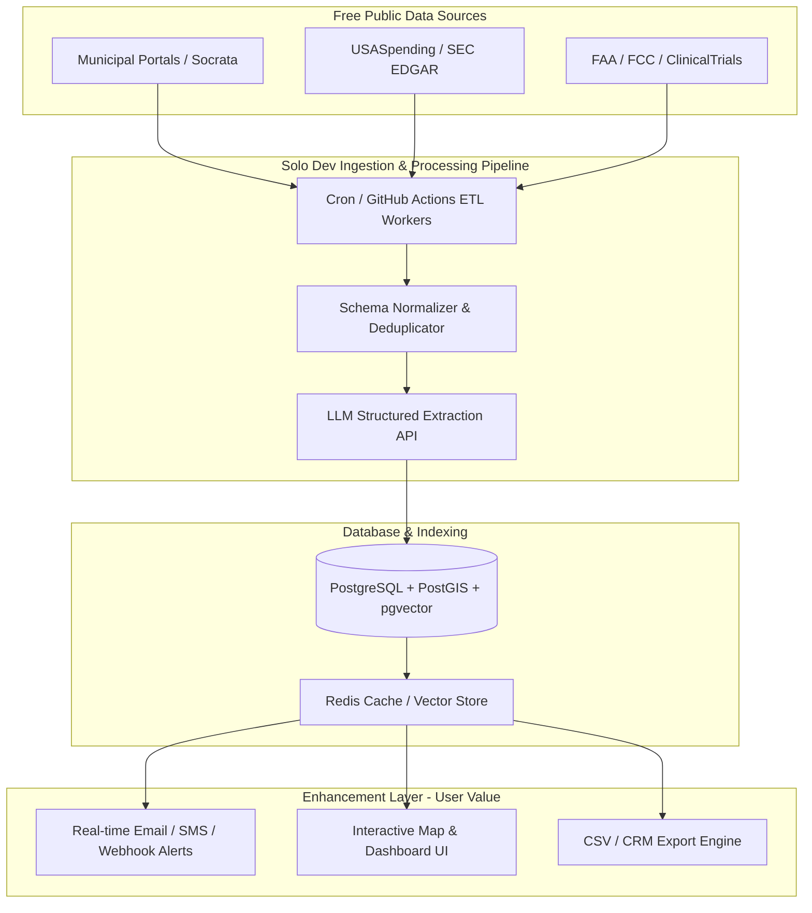

# High-Value Solo Developer Web App Concepts Powered by Free/Open Public Data & APIs

## Executive Summary & The "Zillow Pattern"

The most defensible web applications built by solo developers and micro-SaaS founders rarely rely on proprietary zero-to-one data collection. Instead, they exploit the **"Zillow Pattern"**: taking public, messy, fragmented, or un-indexed open government datasets and building an **Enhancement Layer** on top.

Raw public data is free, but raw public data is painful to query, clean, synthesize, and monitor. High-value B2B and prosumer customers do not pay for access to public data—they pay for:
1. **Canonical Schema Aggregation**: Unifying hundreds of fragmented data formats into a clean, searchable index.
2. **AI & LLM Enrichment**: Converting messy, free-text narrative descriptions into structured parameters.
3. **Proactive Alerting & Event Monitoring**: Pushing instant SMS/Email/Webhook notifications when new records match user criteria.
4. **Spatial & Entity Joins**: Cross-referencing disparate datasets (e.g., matching LLC registration files to FAA tail numbers or municipal permit addresses).
5. **Niche Workflow Integration**: Delivering actionable leads straight into CRMs, webhooks, or mobile views tailored to specific job roles.

This document outlines **6 viable, market-tested B2B and prosumer web app concepts** engineered specifically for a solo developer to launch, host for under $100/month, and scale to $5,000–$30,000+ MRR.

---

## Overview of Primary Open Data APIs & Sources

| Data Domain | Primary Data Sources & APIs | Format & Access Model | Best Enhancement Vector |
| :--- | :--- | :--- | :--- |
| **Municipal Building Permits** | [Socrata SODA API](https://dev.socrata.com/), [US Census BPS](https://www.census.gov/construction/bps/), [ArcGIS REST APIs](https://developers.arcgis.com/rest/) | REST / JSON / GeoJSON / Free | Spatial aggregation, LLM work-scope parsing, contractor lead alerts. |
| **Federal Contracting (GovCon)** | [USASpending.gov v2 API](https://api.usaspending.gov), [SAM.gov API](https://open.gsa.gov/api/sam-api/), [Grants.gov API](https://www.grants.gov/web/grants/developers/xml-extracts.html) | REST / JSON / Free (No auth for USASpending) | Contract expiration tracking, Subcontractor quota matching, SOW parsing. |
| **Clinical Research & Biotech** | [ClinicalTrials.gov REST API v2](https://clinicaltrials.gov/data-api/api), [PubMed E-utilities API](https://www.ncbi.nlm.nih.gov/books/NBK25500/), [OpenFDA API](https://open.fda.gov/apis/) | REST / JSON / XML / Free | Protocol eligibility extraction, PI tracking, competitive trial updates. |
| **Aviation & Aircraft Registry** | [FAA Releasable DB](https://registry.faa.gov/database/ReleasableAircraft.zip), [OpenSky Network API](https://openskynetwork.github.io/opensky-api/), FAA SDR DB | Bulk CSV / REST API / Free | Entity unmasking (shell LLCs), flight hour verification, AD maintenance risk scoring. |
| **Wireless Spectrum & Telecom** | [FCC License View / ULS Downloads](https://www.fcc.gov/reports-research/developers/license-view-api), [FCC ASR DB](https://www.fcc.gov/license-databases), [USGS 3DEP Elevation API](https://epqs.nationalmap.gov/v1/docs) | Bulk Pipe-Delimited `.dat` / REST / Free | Spectrum availability mapping, PostGIS spatial terrain line-of-sight calculation. |
| **SEC EDGAR & Insider Trading** | [SEC EDGAR API](https://www.sec.gov/edgar/sec-api-documentation), [SEC Company Facts API](https://data.sec.gov/) | REST / JSON / XML / Free (Rate limit 10 req/sec) | Sub-second Form 4 XML parsing, cluster buy detection, executive win-rate analytics. |

---

## 6 Detailed Web App Concepts for Solo Developers

---

### Concept 1: PermitPulse — Multi-Jurisdiction Municipal Permit & Commercial Lead Engine

> **Tagline**: Real-time commercial building permit intelligence and contractor lead alerts across 100+ cities.

#### Primary Data Sources & APIs
* **Socrata Open Data API (SODA v2/v3)**: Direct REST API for 100+ city open data portals (NYC, Chicago, Los Angeles, Austin, Seattle, Dallas, etc.).  
  * *Documentation*: [https://dev.socrata.com/](https://dev.socrata.com/)
* **US Census Bureau Building Permits Survey (BPS) API**: Monthly aggregate permit issuance by county/MSA.  
  * *Documentation*: [https://www.census.gov/construction/bps/](https://www.census.gov/construction/bps/)
* **ArcGIS REST Services**: County land record and municipal planning layer feeds.  
  * *Documentation*: [https://developers.arcgis.com/rest/](https://developers.arcgis.com/rest/)

#### Target Customer & Monetization Model
* **Target Customers**: Subcontractors (HVAC, electrical, roofing, plumbing, fire protection), commercial equipment distributors (elevators, commercial generators), commercial real estate brokers, and solar developers.
* **Monetization Model**: B2B Tiered Monthly Subscription SaaS.
  * **Regional Tier**: $99/month (1 state / metropolitan cluster).
  * **Pro Tier**: $299/month (Multi-state coverage, export to CSV/HubSpot, instant SMS alerts for projects >$500k).
  * **Agency/Enterprise**: $799/month (Unlimited team seats, custom CRM webhooks).

#### The Enhancement Layer
Raw city permit data is notoriously broken: NYC labels an HVAC permit as `Alt-2`, Chicago calls it `Easy Permit`, and Austin records it under a custom department code. Furthermore, project descriptions are unstructured text walls (e.g., *"Alteration to 4th fl tenant fit-out, installation of 50-ton VRF HVAC unit and ductwork"*).
1. **Canonical Schema Normalization**: Maps hundreds of city-specific field formats into standard permit types, valuation buckets, and square footage fields.
2. **LLM Work-Scope Classification**: Uses lightweight LLM extraction (Claude Haiku / GPT-4o-mini) to extract exact trade tags (e.g., `HVAC`, `Roofing`, `Fire Suppression`), targeted equipment, and estimated contract values.
3. **Contractor Profile Resolution**: Deduplicates contractor names and addresses across cities to rank trade contractors by active project volume.
4. **Geofenced Automated Lead Alerts**: Allows users to set polygon boundaries or zip code lists to receive instant daily summaries of high-value permit filings.

#### Competitive Gap & Differentiation
Legacy products like BuildZoom Enterprise or Dodge Construction Network charge $10,000–$50,000+/year and focus on enterprise general contractors. **PermitPulse** targets specialized trade subcontractors and suppliers who want lightweight, self-serve mobile alert feeds, geographic filtering, and instant CRM sync at 1/10th the price.

#### Solo Developer Technical Stack & Feasibility
* **Frontend**: Next.js (TypeScript), React Email, Tailwind CSS, Mapbox GL JS.
* **Backend & DB**: Supabase (PostgreSQL + PostGIS for spatial queries), Node.js / Python API background workers.
* **ETL Ingestion**: Scheduled GitHub Actions / Railway Cron jobs running Python scripts querying Socrata endpoints daily.
* **AI Processing**: Queue-backed batching of un-parsed descriptions through LLM API (~$0.0002 cost per permit).
* **Monthly Infrastructure Cost**: ~$40–$90/month (Supabase Pro $25 + Railway worker $20 + LLM API fees ~$20). High feasibility for 1 developer.

---

### Concept 2: GovRecompete — Federal Subcontracting & Contract Re-compete Intelligence

> **Tagline**: Early-warning intelligence engine for expiring federal contracts and small business subcontracting opportunities.

#### Primary Data Sources & APIs
* **USASpending.gov API (v2 REST)**: Complete database of federal contract awards, prime contracts, and sub-awards.  
  * *Documentation*: [https://api.usaspending.gov](https://api.usaspending.gov)
* **SAM.gov Opportunities & Entity APIs**: Active solicitations, entity registrations, and small business socio-economic designations.  
  * *Documentation*: [https://open.gsa.gov/api/sam-api/](https://open.gsa.gov/api/sam-api/)
* **Grants.gov XML Extracts & API**: Federal funding announcements and grant opportunities.  
  * *Documentation*: [https://www.grants.gov/web/grants/developers/xml-extracts.html](https://www.grants.gov/web/grants/developers/xml-extracts.html)

#### Target Customer & Monetization Model
* **Target Customers**: Small and mid-sized government contractors (IT services, cybersecurity, defense sub-contractors, management consulting) looking for upcoming contract renewals before public RFPs hit SAM.gov.
* **Monetization Model**: B2B SaaS Subscription.
  * **Solo Pro**: $199/month (Track up to 50 NAICS/PSC codes, 6-to-18 month renewal alerts).
  * **Team Tier**: $499/month (5 seats, pipeline tracking, small business subcontracting quota analysis).
  * **Enterprise**: $1,299/month (API access, custom competitor win/loss tracking).

#### The Enhancement Layer
By the time a federal RFP is published on SAM.gov, incumbent contractors usually have a massive advantage. Winning contractors track **contract expirations 12–18 months in advance**.
1. **Re-compete Expiration Radar**: Analyzes historical award options years and multi-year contract end dates in USASpending data to compute exact re-compete windows.
2. **Prime-Sub Contracting Graph**: Identifies prime contract holders that missed their mandatory Small Business / SDVOSB / WOSB subcontracting quota goals, flagging prime contractors actively looking for certified sub-partners.
3. **AI Statement of Work (SOW) Summarizer**: Scrapes attached SOW documents from historical awards and extracts key technology tags (e.g., AWS, ServiceNow, Kubernetes, Top Secret clearance required).

#### Competitive Gap & Differentiation
Legacy GovCon intelligence platforms (Deltek GovWin IQ, Bloomberg Government) cost $15,000–$40,000/year and require high-touch sales reps. **GovRecompete** provides self-service credit-card checkout, zero-friction setup, and hyper-focus on mid-tier subcontractors targeting upcoming expiring task orders.

#### Solo Developer Technical Stack & Feasibility
* **Frontend**: SvelteKit or React + Tailwind CSS.
* **Backend & DB**: Managed PostgreSQL with `pgvector` for semantic search over SOW summaries, Python (FastAPI + Dagster) for bulk ETL pipelines.
* **ETL Ingestion**: Daily incremental sync with USASpending `/api/v2/search/spending_by_award/` endpoints.
* **Monthly Infrastructure Cost**: ~$60–$120/month (Hetnzner VPS / Fly.io for workers + Postgres DB + S3 bucket for PDF storage). Extremely maintainable by 1 engineer.

---

### Concept 3: TrialFeasibility — Clinical Trial Protocol & Site Feasibility Tracker

> **Tagline**: AI-powered protocol eligibility analyzer and clinical trial site selection tracker for emerging biotech startups.

#### Primary Data Sources & APIs
* **ClinicalTrials.gov REST API (v2)**: Access to all global clinical trial protocols, eligibility criteria, locations, and status changes.  
  * *Documentation*: [https://clinicaltrials.gov/data-api/api](https://clinicaltrials.gov/data-api/api)
* **NCBI PubMed / MEDLINE E-utilities API**: Metadata and publication records for Principal Investigators (PIs) and trial sponsors.  
  * *Documentation*: [https://www.ncbi.nlm.nih.gov/books/NBK25500/](https://www.ncbi.nlm.nih.gov/books/NBK25500/)
* **OpenFDA API**: FDA drug approval history, orphan drug designations, and adverse event reports.  
  * *Documentation*: [https://open.fda.gov/apis/](https://open.fda.gov/apis/)

#### Target Customer & Monetization Model
* **Target Customers**: Emerging biotech startups, Contract Research Organizations (CROs), clinical trial recruiters, and academic trial site networks.
* **Monetization Model**: B2B Prosumer SaaS.
  * **Researcher Tier**: $249/month (Search and filter normalized eligibility criteria, track 10 indications).
  * **Clinical Ops Tier**: $799/month (Full site/PI scoring database, protocol amendment alert feeds, export capabilities).

#### The Enhancement Layer
ClinicalTrials.gov stores patient eligibility criteria as raw, messy free-text paragraphs (e.g., *"Adults aged 18-65 with Type 2 Diabetes, HbA1c between 7.5% and 10.0%, no prior treatment with GLP-1 agonists within 90 days"*).
1. **Structured Parameter Extraction**: Converts raw eligibility prose into structured numeric ranges and boolean drug history filters using structured LLM outputs.
2. **PI & Site Scoring Engine**: Cross-references trial site locations with PubMed author histories to rank Principal Investigators by publication cadence, therapeutic specialization, and trial completion speed.
3. **Competitive Trial Alerting**: Notifies clinical ops managers whenever a competing trial changes status (e.g., moving from Phase 2 to Phase 3 or expanding into new geography).

#### Competitive Gap & Differentiation
Enterprise pharma intelligence systems (Informa TrialTrove, GlobalData) cost $30,000–$80,000/year and are designed for large pharma companies. **TrialFeasibility** delivers instantaneous, self-service protocol benchmarking and site selection analytics for mid-market biotechs at a fraction of the cost.

#### Solo Developer Technical Stack & Feasibility
* **Frontend**: Next.js (TypeScript), Lucide Icons, Tremor UI / Shadcn UI.
* **Backend & DB**: Supabase (PostgreSQL with JSONB indexes), Meilisearch for ultra-fast full-text searching across medical conditions.
* **ETL Ingestion**: Daily sync using ClinicalTrials.gov v2 API filtering on `LAST_UPDATE_POSTED`.
* **Monthly Infrastructure Cost**: ~$50–$100/month (Supabase + Meilisearch Cloud). High feasibility.

---

### Concept 4: FleetSignal — General Aviation Aircraft Ownership & Maintenance Risk Radar

> **Tagline**: Aircraft ownership unmasking, flight hour verification, and maintenance risk analytics for general aviation.

#### Primary Data Sources & APIs
* **FAA Releasable Aircraft Database**: Master aircraft registrations, engine specifications, dealer file, and document indexes.  
  * *Documentation*: Downloadable daily ZIP CSV from [https://registry.faa.gov/database/ReleasableAircraft.zip](https://registry.faa.gov/database/ReleasableAircraft.zip)
* **OpenSky Network REST API**: Real-time and historical flight tracking data via ADS-B coverage.  
  * *Documentation*: [https://openskynetwork.github.io/opensky-api/](https://openskynetwork.github.io/opensky-api/)
* **FAA Service Difficulty Reporting (SDR) & Airworthiness Directives (AD)**: Public safety and mechanical error databases.

#### Target Customer & Monetization Model
* **Target Customers**: Aircraft sales brokers, pre-buy inspection mechanics, aviation insurance underwriters, and buyers of piston/light-turboprop aircraft (Cirrus, Beechcraft, Cessna, Piper, TBM).
* **Monetization Model**: B2B SaaS.
  * **Pro Broker**: $149/month (Unmask corporate shell owners, track up to 25 aircraft tails).
  * **Commercial / Fleet**: $399/month (Unlimited aircraft tracking, flight hour verification engine, PDF pre-buy inspection risk reports).

#### The Enhancement Layer
Most aircraft registrations list shell LLCs or bank trustees (e.g., *"TVPX Aircraft Solutions Trustee"*), hiding true beneficial owners. Furthermore, logbook flight hours reported during sales can be hard to verify independent of ADS-B data.
1. **LLC Beneficial Owner Unmasking**: Cross-references corporate registry filings, FAA registration addresses, and officer names to reveal the underlying operating entity behind private aircraft shell trusts.
2. **ADS-B Flight Hour Verification**: Ingests OpenSky Network flight ping logs to compute true monthly/annual airframe utilization hours.
3. **Airworthiness Directive (AD) Compliance Radar**: Automatically maps an aircraft tail's specific engine and airframe serial numbers against mandatory FAA AD bulletins to calculate upcoming maintenance liabilities.

#### Competitive Gap & Differentiation
JetNet and AMSTAT charge $5,000–$15,000/year and focus almost exclusively on high-end business jets ($10M+ Class). **FleetSignal** targets the massive, under-served General Aviation market ($200k–$3M aircraft), providing instant online lookup and automated pre-buy risk reports.

#### Solo Developer Technical Stack & Feasibility
* **Frontend**: React, Tailwind CSS, Recharts.
* **Backend & DB**: Python (FastAPI), PostgreSQL for relational data, ClickHouse or DuckDB for fast ADS-B flight ping aggregation.
* **ETL Ingestion**: Daily cron job downloading and diffing the 100MB FAA CSV zip file.
* **Monthly Infrastructure Cost**: ~$45–$80/month (DigitalOcean App Platform / Railway + Postgres DB).

---

### Concept 5: SpectrumRadar — FCC Spectrum & Telecom Infrastructure Opportunity Scanner

> **Tagline**: Wireless spectrum availability mapping and cell tower co-location scanner for WISPs and private 5G integrators.

#### Primary Data Sources & APIs
* **FCC Universal Licensing System (ULS) Bulk Data**: Complete database of commercial, microwave, cellular, and CBRS radio spectrum licenses.  
  * *Documentation*: [https://www.fcc.gov/reports-research/developers/license-view-api](https://www.fcc.gov/reports-research/developers/license-view-api)
* **FCC Antenna Structure Registration (ASR) Database**: Locations, tower heights, and ownership of registered cell and broadcast towers.  
  * *Documentation*: [https://www.fcc.gov/license-databases](https://www.fcc.gov/license-databases)
* **USGS 3DEP Elevation API**: 3D Elevation Program point queries for terrain profiles.  
  * *Documentation*: [https://epqs.nationalmap.gov/v1/docs](https://epqs.nationalmap.gov/v1/docs)

#### Target Customer & Monetization Model
* **Target Customers**: Wireless Internet Service Providers (WISPs), private 5G network integrators (for factories, mines, ports), cell tower site acquisition agents, and municipal broadband planning consultants.
* **Monetization Model**: B2B SaaS.
  * **Pro Planner**: $299/month (County-level spectrum lookup, line-of-sight terrain analysis tool).
  * **Operator Tier**: $899/month (Multi-state license tracking, expiring spectrum alerts, tower co-location finder).

#### The Enhancement Layer
The FCC ULS data is distributed as weekly multi-gigabyte pipe-delimited `.dat` files with complex relational codes.
1. **Interactive Vector Map Layer**: Parses FCC license polygons and frequency allocations into PostGIS spatial layers, displaying available vs. encumbered spectrum (e.g., CBRS, 6GHz, 11GHz microwave) down to census tract levels.
2. **Line-of-Sight & Terrain Calculation**: Integrates USGS elevation point queries to let network engineers simulate fixed wireless propagation paths between FCC-registered towers and customer locations.
3. **Expiring Spectrum & Lease Radar**: Identifies 10-year spectrum licenses nearing expiration without renewal filings, highlighting prime acquisition or leasing targets.

#### Competitive Gap & Differentiation
Legacy telecom GIS tools (Comsearch, SpectrumEffect, TowerXchange) are custom enterprise software requiring $20,000+ deployments. **SpectrumRadar** provides a browser-based, map-first tool that any regional WISP or private 5G installer can sign up for and use immediately.

#### Solo Developer Technical Stack & Feasibility
* **Frontend**: Next.js, Mapbox GL JS / Deck.gl for rendering spatial spectrum overlays.
* **Backend & DB**: Python worker running GDAL / Shapely, PostGIS database for spatial querying.
* **ETL Ingestion**: Automated weekly download script converting FCC `.dat` files into PostGIS table updates.
* **Monthly Infrastructure Cost**: ~$60–$110/month (Hetzner Dedicated VPS running PostGIS + Mapbox API usage).

---

### Concept 6: InsiderSignal — SEC EDGAR Form 4 & 13F Real-Time Webhook Engine

> **Tagline**: Sub-second SEC Form 4 insider trading webhooks, cluster buy alerts, and executive track-record analytics.

#### Primary Data Sources & APIs
* **SEC EDGAR Data APIs**: Real-time submissions, company facts, and financial datasets.  
  * *Documentation*: [https://www.sec.gov/edgar/sec-api-documentation](https://www.sec.gov/edgar/sec-api-documentation)
* **SEC Developer Services (`data.sec.gov`)**: JSON endpoints for company filings and RSS atom feeds.  
  * *Documentation*: [https://www.sec.gov/developer](https://www.sec.gov/developer)
* **SEC Ticker to CIK Mapping**: `https://www.sec.gov/files/company_tickers.json`

#### Target Customer & Monetization Model
* **Target Customers**: Boutique hedge funds, quantitative trading desks, financial newsletter creators, and active retail traders.
* **Monetization Model**: B2B Developer / Trader Subscription.
  * **Trader Tier**: $49/month (Real-time email/Discord alerts for Form 4 filings with >$100k open-market purchases).
  * **Quant / Developer Tier**: $199/month (Sub-second Webhook delivery of structured Form 4 JSON, historical database REST API).
  * **Fund Tier**: $499/month (Cluster-buy signals, executive historical trade performance scoring).

#### The Enhancement Layer
SEC EDGAR posts Form 4 XML filings immediately upon receipt, but raw XML contains technical transaction codes (`P` for open market purchase, `M` for option exercise) and requires CIK-to-ticker mapping.
1. **Sub-Second XML Parsing & Normalization**: Listens to EDGAR RSS feeds, parses Form 4 XML in under 100 milliseconds, strips noise (ignoring routine option exercises or tax-withholding sales), and isolates genuine open-market buying.
2. **Cluster Buy Signal Detection**: Automatically flags "Cluster Buys"—when 3 or more officers/directors of the same company purchase stock in the open market within a 7-day window.
3. **Executive Win-Rate Analytics**: Computes historical 30/60/90-day post-trade stock performance for individual C-suite executives to rank which insiders possess real predictive signal.
4. **Developer Webhook Engine**: Delivers clean, structured JSON payloads directly to customers' algorithmic trading endpoints or Slack channels.

#### Competitive Gap & Differentiation
Basic web portals (OpenInsider, Quiver Quantitative) offer simple table views with manual browser refreshing. Institutional data feeds (Bloomberg, FactSet) cost $24,000+/year. **InsiderSignal** fills the gap for developer-first webhooks and algorithmic trading triggers with sub-second execution.

#### Solo Developer Technical Stack & Feasibility
* **Frontend**: React / Next.js dashboard, Tailwind CSS.
* **Backend Engine**: Go or Rust service for ultra-fast XML parsing, Redis Pub/Sub for sub-second webhook fanout, Node.js REST API.
* **Database**: PostgreSQL for historical trades and executive profiles.
* **Compliance**: Enforces SEC's 10 req/sec rate limit with custom `User-Agent` headers as required by SEC guidelines.
* **Monthly Infrastructure Cost**: ~$30–$70/month (VPS + Redis + Postgres). Extremely low overhead and high gross margin (>90%).

---

## Solo Developer Architecture & Execution Blueprint

To successfully launch and maintain an open-data SaaS app as a 1-person team, follow these core principles:

### 1. Robust Ingestion Architecture
* **Decouple Ingestion from Serving**: Never fetch public APIs directly on user web requests. Run background ETL jobs (via Railway, Fly.io, or GitHub Actions) that insert into your own database, serving users strictly from your optimized cache/Postgres tables.
* **Defensive Schema Parsing**: Public data schemas shift without warning. Wrap ingestion workers in try-catch blocks with daily Sentry error alerts so broken external fields never crash your web application.

### 2. LLM Cost Optimization Strategy
* Do not feed full text into expensive LLM models. Filter raw text first (e.g., regex matching permit types or contract titles), then pass only high-probability records to fast, lower-cost models (e.g., Claude Haiku or GPT-4o-mini). Use structured JSON output schemas (`response_format: { type: "json_object" }`).

### 3. Pricing Strategy for Solo SaaS
* **Never offer free tiers for enterprise/B2B data apps**. Offer a 7-day or 14-day free trial requiring a credit card up front.
* Target **$99/month to $499/month price points**. B2B customers expense these costs on corporate cards without requiring procurement approval.

---

## Primary Citation & Documentation Index

1. **U.S. Securities and Exchange Commission (SEC) EDGAR API**:  
   * Portal: [https://www.sec.gov/edgar/sec-api-documentation](https://www.sec.gov/edgar/sec-api-documentation)  
   * Developer Page: [https://www.sec.gov/developer](https://www.sec.gov/developer)
2. **USAspending.gov API (v2)**:  
   * Portal: [https://api.usaspending.gov](https://api.usaspending.gov)  
   * GitHub: [https://github.com/fedspendingtransparency/usaspending-api](https://github.com/fedspendingtransparency/usaspending-api)
3. **ClinicalTrials.gov REST API (v2)**:  
   * Portal: [https://clinicaltrials.gov/data-api/api](https://clinicaltrials.gov/data-api/api)
4. **Socrata Open Data API (SODA)**:  
   * Developer Documentation: [https://dev.socrata.com/](https://dev.socrata.com/)
5. **FAA Releasable Aircraft Database**:  
   * Data Portal: [https://registry.faa.gov/database/ReleasableAircraft.zip](https://registry.faa.gov/database/ReleasableAircraft.zip)
6. **OpenSky Network REST API**:  
   * Documentation: [https://openskynetwork.github.io/opensky-api/](https://openskynetwork.github.io/opensky-api/)
7. **Federal Communications Commission (FCC) Developer Hub & ULS**:  
   * License View API: [https://www.fcc.gov/reports-research/developers/license-view-api](https://www.fcc.gov/reports-research/developers/license-view-api)  
   * Developers Hub: [https://www.fcc.gov/developers](https://www.fcc.gov/developers)
8. **USGS 3D Elevation Program (3DEP) API**:  
   * Documentation: [https://epqs.nationalmap.gov/v1/docs](https://epqs.nationalmap.gov/v1/docs)
9. **US Census Bureau Building Permits Survey (BPS)**:  
   * Documentation: [https://www.census.gov/construction/bps/](https://www.census.gov/construction/bps/)
10. **SAM.gov Developer API**:  
    * Documentation: [https://open.gsa.gov/api/sam-api/](https://open.gsa.gov/api/sam-api/)

---
*Research compiled and synthesized for solo developer product development.*
