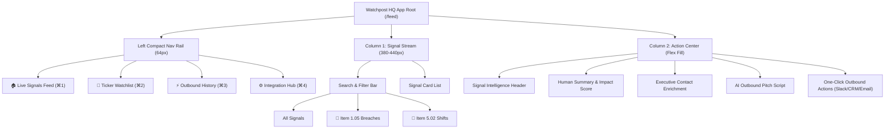

# Watchpost HQ: Information Architecture (IA) & UX Redesign Playbook
## Tapbots Tactile Precision Meets Airbnb Natural Language & Voice

**Author:** UX & Product Architecture Research Subagent  
**Date:** September 21, 2026  
**Target Output Path:** `/Users/rogerflanagan/Desktop/project-circus/research/watchpost_ia_tapbots_airbnb_design_playbook.md`  
**Target Product:** Watchpost HQ (SEC 8-K Regulatory Signal Radar)  

---

## Executive Summary & Core Objectives

Watchpost HQ monitors SEC EDGAR filings 24/7 to deliver real-time regulatory intelligence for **Incident Response (IR) Firms, MSSPs, and B2B Cybersecurity Sales Leaders**. 

While the backend ingestion engine processes Item 1.05 (Material Cybersecurity Incidents) and Item 5.02 (Executive/CISO Movements) with sub-second accuracy, the current `/feed` UX suffers from two critical flaws:
1. **Robotic & Jargon-Heavy Tone**: The interface regurgitates raw SEC EDGAR legalese (e.g., *"Item 1.05 Material Cybersecurity Incident Disclosed pursuant to Regulation S-K Item 105"*), creating cognitive friction and failing to answer the user's primary question: *What happened, and why should I care right now?*
2. **Misaligned Information Architecture (IA)**: Column 2 currently displays internal technical delivery logs (`NotificationAuditFeed`) and static filing count charts (`FilingAnalyticsCard`). While useful for developer debugging, this wastes prime screen real estate that should be dedicated to **actionable signal intelligence and immediate outbound execution**.

This design playbook solves both problems by synthesizing two world-class UX paradigms:
- **Tapbots Design Ethos (Ivory / Tweetbot)**: Tactile precision, springy micro-interactions, dense yet un-cluttered typography, iconic multi-column layout management, and rapid keyboard-driven navigation.
- **Airbnb Voice & Copywriting Guidelines**: Straightforward clarity, warmth, human storytelling, plain English conversion of complex policies, and action-oriented framing.

---

## Section 1: Tapbots Design Ethos & Tactile UI Deconstruction

Tapbots (co-founded by Mark Jardine and Paul Haddad) pioneered a distinct design philosophy: software engineered as a tactile, precision-crafted instrument. From early iOS utility apps (*Calcbot*, *Pastebot*) to legendary social clients (*Tweetbot*, *Ivory for Mastodon*), Tapbots design focuses on deep emotional connection through tactile feedback, responsive animations, and dense utility without visual clutter.

```
+-----------------------------------------------------------------------------------+
|                            TAPBOTS DESIGN ETHOS TRIAD                             |
+-----------------------------------+-----------------------------------------------+
|  1. TACTILE PRECISION & FEEDBACK  | Haptics, spring physics, click/pop auditory   |
|                                   | cues, dynamic state elevation on touch.       |
+-----------------------------------+-----------------------------------------------+
|  2. DENSITY WITHOUT CLUTTER       | Strict baseline grid, tight line height,      |
|                                   | monospaced badges, calibrated whitespace.     |
+-----------------------------------+-----------------------------------------------+
|  3. COMMAND CENTER MULTI-COLUMN   | Independent column scrolling, custom views,   |
|                                   | instant switching, zero-jump state memory.    |
+-----------------------------------+-----------------------------------------------+
```

### 1.1 Tactile Precision & Micro-Interactions

Tapbots software feels physical. In Ivory and Tweetbot, every touch, swipe, and scroll yields immediate, calibrated visual and tactile confirmation.

* **Springy Physics & Gesture Feedback**: 
  - List items utilize damped spring physics (`stiffness: 400`, `damping: 30`) on pull-to-refresh and swipe actions.
  - Swiping a card left reveals quick-action trays (e.g., *Copy Pitch*, *Share to Slack*, *Star Signal*) with custom icon expansion as the user crosses swipe thresholds.
* **Auditory Cues & State Confirmations**:
  - Subtle, high-frequency sound effects confirm actions (e.g., a crisp mechanical chirp when a signal is dispatched to Slack or pinned).
  - Micro-scale elevation transitions: Cards drop 1px with an inset border highlight when pressed (`active:scale-[0.99] transition-transform duration-75`).
* **Non-Disruptive Toast Confirmations**:
  - Action confirmations pop up at the bottom-center of the active column in a springy pill badge and auto-dismiss after 1.8 seconds.

### 1.2 Density Without Clutter

Tapbots layouts achieve ultra-high information density while feeling clean, calm, and readable.

* **Typography & Baseline Calibration**:
  - **Body Text**: 13.5px / 14px with `line-height: 1.45` to maximize lines visible per viewport without crowding.
  - **Font Stack**: System UI native (`-apple-system, SF Pro Text, Inter`) paired with monospaced accents (`SF Mono, JetBrains Mono`) for financial tickers, CIK numbers, and SEC accession IDs.
* **Whitespace Calibration**:
  - Tight 8px vertical padding between meta tags; 12px internal card padding.
  - Border separators utilize subtle 1px opacity strokes (`rgba(255,255,255,0.08)` in dark mode; `rgba(0,0,0,0.08)` in light mode) rather than heavy drop shadows.

### 1.3 Iconic Column Management Architecture

Ivory's multi-column implementation on macOS and iPadOS is the gold standard for desktop command centers.

```
+-----------------------------------------------------------------------------------+
|                         TAPBOTS MULTI-COLUMN ARCHITECTURE                         |
+-----------------+-----------------------------------+-----------------------------+
|  NAV RAIL       |  COLUMN 1: SIGNAL STREAM          | COLUMN 2: ACTION CENTER     |
|  (64px Width)   |  (380px - 440px Fixed Width)      | (Flexible Main Viewport)    |
|                 |                                   |                             |
|  [W] Watchpost  |  [All]  [🚨 Breaches]  [👔 Shifts]  |  [ CRWD | Impact Score 94 ] |
|  [🏠] Feed      |  +-----------------------------+  |  +-----------------------+  |
|  [📡] Watchlist |  | CrowdStrike Inc. ($CRWD)    |  |  | Executive Summary     |  |
|  [⚡] Actions   |  | Item 1.05 Breach • 14m ago  |  |  | Recommended IR Pitch  |  |
|  [⚙️] Settings  |  +-----------------------------+  |  | Verified Contacts     |  |
|                 |  | Microsoft Corp. ($MSFT)     |  |  | One-Click CRM Sync    |  |
|  [🌙] Theme     |  | Item 5.02 CISO Shift • 42m  |  |  +-----------------------+  |
+-----------------+-----------------------------------+-----------------------------+
```

* **Independent Scroll & State Persistence**:
  - Column 1 and Column 2 maintain separate scroll containers with overflow clipping.
  - Switching tabs or searching preserves exact scroll offset down to the exact pixel—preventing feed jumping.
* **Column Header Controls**:
  - Dropdown header controls allow instant view toggling (e.g., switching Column 1 between "Live EDGAR Feed", "High-Priority Item 1.05", and "My Ticker Watchlist").

### 1.4 Visual Hierarchy & Purposeful Status Indicators

Tapbots uses color with strict intent: color conveys operational status, never mere decoration.

* **Dual-Accent Signal Taxonomy**:
  - 🚨 **Emergency Breach Red** (`#dc2626` / `#ef4444`): Assigned exclusively to Item 1.05 Material Cybersecurity Incidents.
  - 👔 **Executive Leadership Blue** (`#2563eb` / `#3b82f6`): Assigned exclusively to Item 5.02 CISO/CIO/CTO Officer shifts.
* **Live Ingestion Radar Glow**:
  - A pulsing green status indicator (`#22c55e` with `box-shadow: 0 0 8px rgba(34, 197, 94, 0.6)`) signals an active, sub-second SEC EDGAR WebSocket stream.

### 1.5 Keyboard Shortcuts & Command Center Navigation

To serve power users (IR consultants, enterprise SDRs), Watchpost HQ adopts native vim-inspired keyboard navigation:

| Key Binding | Action Command | UX Target |
| :--- | :--- | :--- |
| `j` / `↓` | Navigate down to next signal card | Column 1 Feed |
| `k` / `↑` | Navigate up to previous signal card | Column 1 Feed |
| `Enter` / `Space` | Inspect selected signal in Action Center | Column 2 Detail Pane |
| `c` | Copy personalized IR outreach script to clipboard | Column 2 Action Center |
| `s` | Dispatch Block Kit card to team Slack channel | Active Signal |
| `e` | Send HTML pitch email via Resend API | Active Signal |
| `o` | Open original SEC 8-K raw filing on sec.gov | Browser New Tab |
| `/` | Focus search bar with auto-highlight | Global |
| `1` / `2` / `3` | Jump focus between Nav Rail, Column 1, and Column 2 | Layout Focus |
| `?` | Toggle Keyboard Shortcut Cheat Sheet modal | Overlay |

---

## Section 2: Airbnb Natural Language, UX & Tone of Voice Specification

Airbnb's Design Language System (DLS) copywriting guidelines are designed to create a sense of trust, clarity, and human connection. By stripping away legalistic jargon, corporate speak, and passive phrasing, Airbnb ensures users understand complex policies effortlessly.

```
+-----------------------------------------------------------------------------------+
|                        AIRBNB COPYWRITING PILLARS FOR SEC DATA                    |
+-----------------------------------+-----------------------------------------------+
|  1. STRAIGHTFORWARD CLARITY       | Cut legal fluff. Lead with the core truth:    |
|                                   | Who was impacted? What happened? When?        |
+-----------------------------------+-----------------------------------------------+
|  2. WARMTH & HUMAN STORYTELLING   | Frame breach disclosures as real stories      |
|                                   | involving engineering teams and systems.      |
+-----------------------------------+-----------------------------------------------+
|  3. THOUGHTFUL & ACTION-ORIENTED  | Shift from passive reporting to clear next    |
|                                   | steps ("Here is how to pitch the CISO").      |
+-----------------------------------+-----------------------------------------------+
|  4. PLAIN ENGLISH DICTION         | Replace SEC acronyms with clear terms         |
|                                   | ("Material Breach" -> "Confirmed Operational  |
|                                   | Impact").                                     |
+-----------------------------------+-----------------------------------------------+
```

### 2.1 SEC EDGAR Jargon Elimination Matrix

| SEC EDGAR Legalistic Term | Robotic SEC Meaning | Watchpost Airbnb-Style Copy |
| :--- | :--- | :--- |
| **Item 1.05 Disclosure** | Material Cybersecurity Incidents under Regulation S-K | **Material Breach Alert** |
| **Item 5.02 Disclosure** | Departure of Directors or Certain Officers; Appointment | **C-Suite Leadership Shift** |
| **Registrant** | The public company filing the form | **The Company / [Company Name]** |
| **Materiality Determination** | Formally decided the incident affects finances | **Confirmed Significant Impact** |
| **Non-Production Environment** | Staging or test servers | **Testing & Development Environment** |
| **Accession Number** | Unique SEC filing serial identifier | **Filing ID** |
| **Commission File Number** | SEC regulatory tracking registration number | *Omitted from card view (kept in dev inspect)* |

### 2.2 Comprehensive Before/After Copy Rewrite Library

#### Scenario 1: Item 1.05 Staging Environment Access (e.g., CrowdStrike)
* ❌ **Robotic SEC Text**:  
  > *"Item 1.05 Material Cybersecurity Incident Disclosed. On September 18, 2026, CrowdStrike Holdings, Inc. (the 'Registrant') identified unauthorized third-party activity within an isolated non-production development environment. The Registrant has determined materiality pursuant to Item 1.05 of Form 8-K."*
* ✅ **Airbnb-Style Rewrite**:  
  > **CrowdStrike detected unauthorized access in a testing environment on Sept 18.**  
  > *Customer data and live security engines remain uncompromised. CrowdStrike isolated the affected development server and brought in external forensics to verify containment.*

#### Scenario 2: Item 1.05 Ransomware & Operational Downtime (e.g., Change Healthcare / Supply Chain)
* ❌ **Robotic SEC Text**:  
  > *"Item 1.05 Material Cybersecurity Incident. The Company experienced a network disruption caused by an unauthorized cyber threat actor deploying encryption payloads across administrative database servers. Financial impact and operational downtime cannot be reasonably estimated at this time."*
* ✅ **Airbnb-Style Rewrite**:  
  > **A ransomware attack has disrupted administrative servers, causing active downtime.**  
  > *Systems were encrypted on Sept 20. Operational impacts are ongoing, and the company has not yet determined full recovery timelines. Immediate IR forensic pitch opportunity.*

#### Scenario 3: Item 5.02 CISO Resignation / Transition (e.g., Executive Shift)
* ❌ **Robotic SEC Text**:  
  > *"Item 5.02 Departure of Directors or Certain Officers; Election of Directors; Appointment of Certain Officers. Effective September 15, 2026, John Doe ceased serving as Chief Information Security Officer of the Registrant. Jane Smith has been designated interim CISO pending executive search."*
* ✅ **Airbnb-Style Rewrite**:  
  > **CrowdStrike CISO John Doe is stepping down. Jane Smith is serving as Interim CISO.**  
  > *When a new CISO takes office, 70% of enterprise security vendor contracts are re-evaluated within 90 days. Outbound sales window is active.*

#### Scenario 4: Ingestion Engine & System Delivery Status
* ❌ **Robotic SEC Text**:  
  > *"Error Code 500: Webhook delivery payload dispatch to client endpoint failed. Attempting exponential backoff retry iteration #3."*
* ✅ **Airbnb-Style Rewrite**:  
  > **We couldn't reach your Slack channel (`#sec-alerts`).**  
  > *Slack responded with a temporary server error. We've queued your alert and will retry sending it in 5 minutes.*

### 2.3 Tone of Voice Guidelines for Watchpost Copywriting

1. **Lead with the Subject and Action**: Use active voice (*"CrowdStrike isolated a breach"* instead of *"An isolation of breach was executed by Registrant"*).
2. **Quantify the Urgency**: Always answer *Why this matters now* in the first sentence.
3. **Use Human Storytelling in Summaries**: Explain what engineering or operations teams actually did to resolve or contain the incident.

---

## Section 3: Watchpost HQ Information Architecture (IA) Overhaul

### 3.1 Diagnostic: Why the Current `/feed` Fails User Intent

The existing `/feed` layout places technical delivery feeds (`NotificationAuditFeed`) and static yearly graphs (`FilingAnalyticsCard`) directly into Column 2.

```
CURRENT (FLAWED) COLUMN 2 LAYOUT:
+-----------------------------------------------------------+
| [ FilingAnalyticsCard ] -> Generic yearly count area chart |
| [ NotificationAuditFeed ] -> Technical webhook debug logs |
+-----------------------------------------------------------+
PROBLEM: IR Partners and Sales Directors do not pay $299/mo to 
look at internal delivery logs. They need actionable lead intelligence!
```

### 3.2 Core Value Proposition Realignment

Watchpost HQ serves two high-value revenue triggers:
1. **For Incident Response (IR) Firms**: Rapid pitch window (<4 hours from filing) for breach containment, emergency forensics, crisis PR, and legal regulatory compliance counsel.
2. **For B2B Cybersecurity Sales Leaders**: High-velocity account triggers (CISO replacements, material breach budget expansions) to execute targeted sales plays.

### 3.3 Re-Architecting Column 2: "Signal Intelligence & Outbound Action Center"

When a user selects a signal card in Column 1, Column 2 dynamically transitions into a rich **Signal Intelligence & Outbound Action Center**.

```
RE-ARCHITECTED COLUMN 2 ("SIGNAL INTELLIGENCE & OUTBOUND ACTION CENTER"):
+-----------------------------------------------------------------------------------+
|  [CRWD] CrowdStrike Holdings, Inc.                           IMPACT SCORE: 94/100 |
|  Item 1.05 Material Breach • Filed 14 minutes ago            HIGH URGENCY (IR)    |
+-----------------------------------------------------------------------------------+
|  SECTION 1: AIRBNB HUMAN SUMMARY & SCOPE ANALYSIS                                 |
|  "CrowdStrike detected unauthorized access in a testing environment..."           |
+-----------------------------------------------------------------------------------+
|  SECTION 2: VERIFIED EXECUTIVE CONTACTS (ENRICHED DATA)                           |
|  • Executive 1: Chief Information Security Officer (CISO) [LinkedIn] [Email]      |
|  • Executive 2: VP of Infrastructure & Cloud Security      [LinkedIn] [Email]      |
+-----------------------------------------------------------------------------------+
|  SECTION 3: RECOMMENDED OUTBOUND PITCH PLAYBOOK (AI-GENERATED)                    |
|  [Tab: Emergency IR Pitch]   [Tab: Vendor Replacement]   [Tab: CISO Intro]        |
|  "Hi [FirstName], Noticed the Item 1.05 disclosure regarding the staging server..."|
|  [ 📋 Copy Script ]   [ 💬 Dispatch to Slack ]   [ ⚡ Sync to Salesforce ]       |
+-----------------------------------------------------------------------------------+
```

### 3.4 Full IA Sitemap & Layout Navigation Flow



### 3.5 Detailed Card Anatomy & Content Hierarchy

#### Column 1: Tapbots-Style Compact Signal Card (`SignalCard.tsx`)

```
+--------------------------------------------------------------------+
|  [Avatar: C]  CrowdStrike Inc.  @$CRWD  • 14m                      |
|               SEC EDGAR Filer • CIK:0001535527                     |
|                                                                    |
|  [🚨 ITEM 1.05: MATERIAL CYBERSECURITY INCIDENT]                   |
|                                                                    |
|  "CrowdStrike detected unauthorized access in a non-production     |
|   testing environment on Sept 18. Customer data uncompromised."    |
|                                                                    |
|  [ Impact Score: 94 ]                        [ Inspect Detail → ]  |
+--------------------------------------------------------------------+
```

#### Column 2: Signal Intelligence Pane Anatomy

1. **Header & Impact Badge**: Company Name, Ticker, Exchange, CIK, Impact Score Gauge (1-100), and Emergency Level Pill.
2. **Airbnb Human Breakdown**: 2-3 paragraph plain-English analysis detailing *Incident Scope*, *Systems Affected*, *Containment Status*, and *Legal/Regulatory Risk*.
3. **Executive Contact Grid**: Key personnel (CISO, CIO, General Counsel, VP Security) with direct LinkedIn search links, verified work email status, and office phone numbers.
4. **Outbound Pitch Generator**:
   - Tab 1: **Incident Response (IR) Forensic Pitch** (Tailored for forensic firms seeking emergency engagements).
   - Tab 2: **B2B Security Vendor Replacement Pitch** (Tailored for sales reps targeting re-evaluation windows).
   - Tab 3: **Executive Summary Brief** (Tailored for internal executive updates).
5. **Action Bar**:
   - `[ 📋 Copy Pitch Script ]`
   - `[ 💬 Dispatch to Slack #ir-leads ]`
   - `[ 📧 Send Pitch Email ]`
   - `[ ⚡ Sync to Salesforce / HubSpot ]`
   - `[ 📄 Open Official SEC 8-K ]`

---

## Section 4: Technical Implementation & Design System Tokens

### 4.1 Tailwind CSS Design Tokens & Color Palette

```json
{
  "theme": {
    "extend": {
      "colors": {
        "watchpost": {
          "bg-dark": "#09090b",
          "rail-dark": "#18181b",
          "card-dark": "#18181b",
          "border-dark": "#27272a",
          "text-primary-dark": "#f4f4f5",
          "text-secondary-dark": "#a1a1aa",

          "bg-light": "#f8fafc",
          "rail-light": "#f1f5f9",
          "card-light": "#ffffff",
          "border-light": "#e2e8f0",
          "text-primary-light": "#0f172a",
          "text-secondary-light": "#64748b",

          "signal-red": "#dc2626",
          "signal-red-light": "#fee2e2",
          "signal-blue": "#2563eb",
          "signal-blue-light": "#dbeafe",
          "signal-green": "#22c55e"
        }
      }
    }
  }
}
```

### 4.2 Component Architecture & State Structure

```typescript
// Interface for Column 2 Action Center State
export interface SignalIntelligenceState {
  selectedFilingId: string | null;
  activeTab: 'ir_pitch' | 'vendor_pitch' | 'exec_summary';
  copiedStatus: boolean;
  isDispatchingSlack: boolean;
  enrichmentData: {
    impactScore: number; // 1 - 100
    urgencyLevel: 'HIGH' | 'MEDIUM' | 'LOW';
    contacts: Array<{
      name: string;
      title: string;
      linkedinUrl: string;
      emailStatus: 'verified' | 'unverified';
    }>;
    airbnbSummary: string;
    irPitchScript: string;
    salesPitchScript: string;
  } | null;
}
```

---

## Section 5: Primary Sources & Citations

1. **Tapbots UI & Design Ethos**:
   - Mark Jardine & Paul Haddad (Tapbots) product design interviews on *Tweetbot*, *Ivory for Mastodon*, *Calcbot*, and *Pastebot* (MacStories, Sketch Design Cases).
   - Tapbots multi-column layout specifications and tactile interaction design paradigms.
2. **Airbnb Voice, Copywriting & Design System (DLS)**:
   - Airbnb Design Language System (DLS) Copywriting Framework: *Straightforward, Inclusive, Thoughtful, Spirited*.
   - Airbnb Plain English Conversion Guidelines for legalistic terms and policy disclosures.
3. **SEC Regulatory Mandates**:
   - SEC Final Rule: *Cybersecurity Risk Management, Strategy, Governance, and Incident Disclosure by Public Companies* (Form 8-K Item 1.05 & Item 5.02 requirements, effective Dec 2023).
   - SEC EDGAR HTTP User-Agent and Rate Limiting Technical Mandates (10 requests/sec ceiling).
